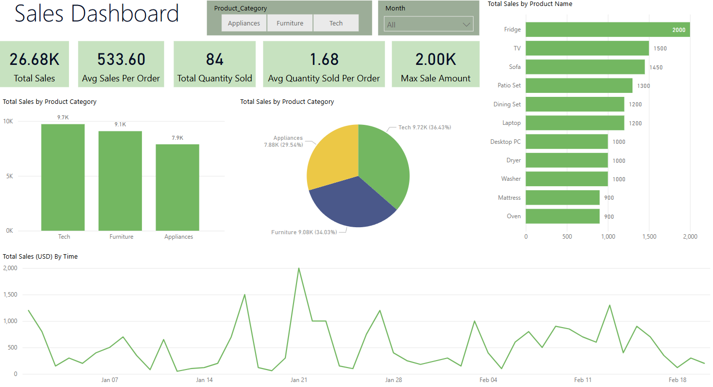

# 📊 Power BI Basics Project – Beginner Sales Dashboard

## 🧠 Project Overview

This Power BI project walks through the process of creating an interactive dashboard using fictional sales data. It's designed to demonstrate core Power BI skills such as data import, transformation, measure creation, and dashboard design.

---

## 🎯 Goals

- Learn the end-to-end process of building a Power BI report
- Build a dashboard that communicates insights clearly

---

## 📁 Data Source

- Dataset: Custom-created CSV file with 50 rows of fictional sales data  
- [Download CSV on GitHub](./ChatGPT_Beginner(Sheet1).csv)

---

## 🛠️ Tools & Skills Used

- **Tools**: Power BI Desktop, Power Query Editor
- **Skills**:  
  - Data cleaning in Power Query  
  - DAX measures for KPIs  
  - Dashboard design with visuals and slicers

---

## 🧱 Project Workflow

1. Imported the dataset from CSV into Power BI
2. Explored and cleaned the data in Power Query
3. Created key DAX measures
4. Built visuals including:
   - KPI cards
   - Bar Chart (Sales by Category)
   - Bar chart (Top 10 Products)
   - Pie chart (Sales by Category)
   - Line chart (Sales over Time)
5. Added slicers
6. Applied theme and styling

---

## 📌 Key Insights

- The **Technology** category generated the highest revenue.
- The **average order value** was approximately **$500**.
- The **Fridge** was the top-selling product by sales.

---

## 🖼️ Visuals

  

---

## 📘 What I Learned

- How to use **Power Query** for data cleaning and transformation
- How to create and apply **DAX measures** for interactive visuals
- How to design a complete report, including visuals and slicers
- How to use **themes** and **formatting** to create a polished, professional dashboard